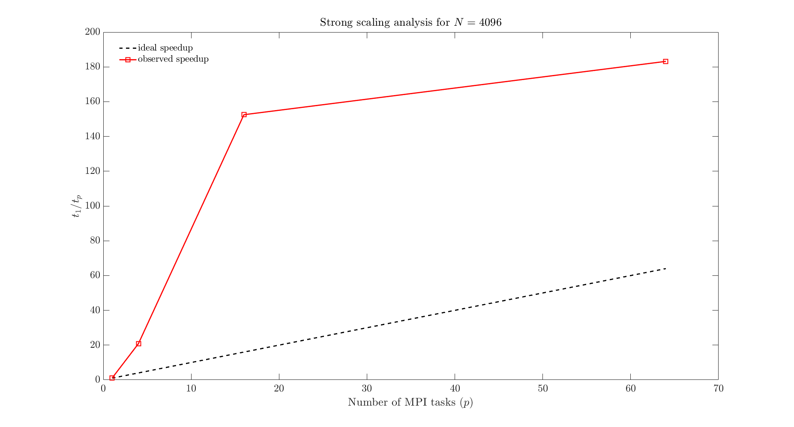
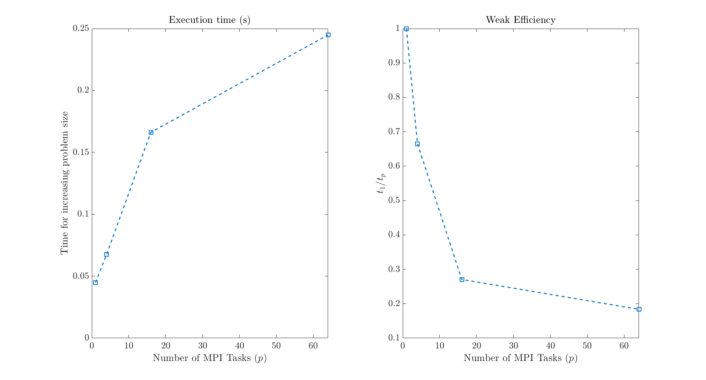

## Strong and weak scaling for Jacobi iteration in MPI ##
For the strong scaling test, I use N = 4096. For the weak scaling test,
the work per processor was Nl = 200.

## Timings for parallel sample sort ##

N        | Time (s)  
10^4   | 0.076     
10^5   | 0.197     
10^6   | job kept exiting with strange errors on Prince  
